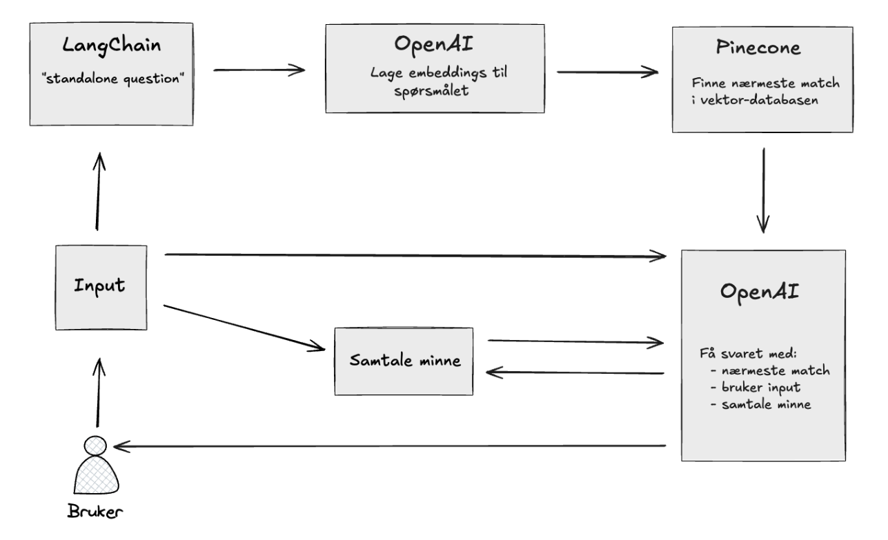
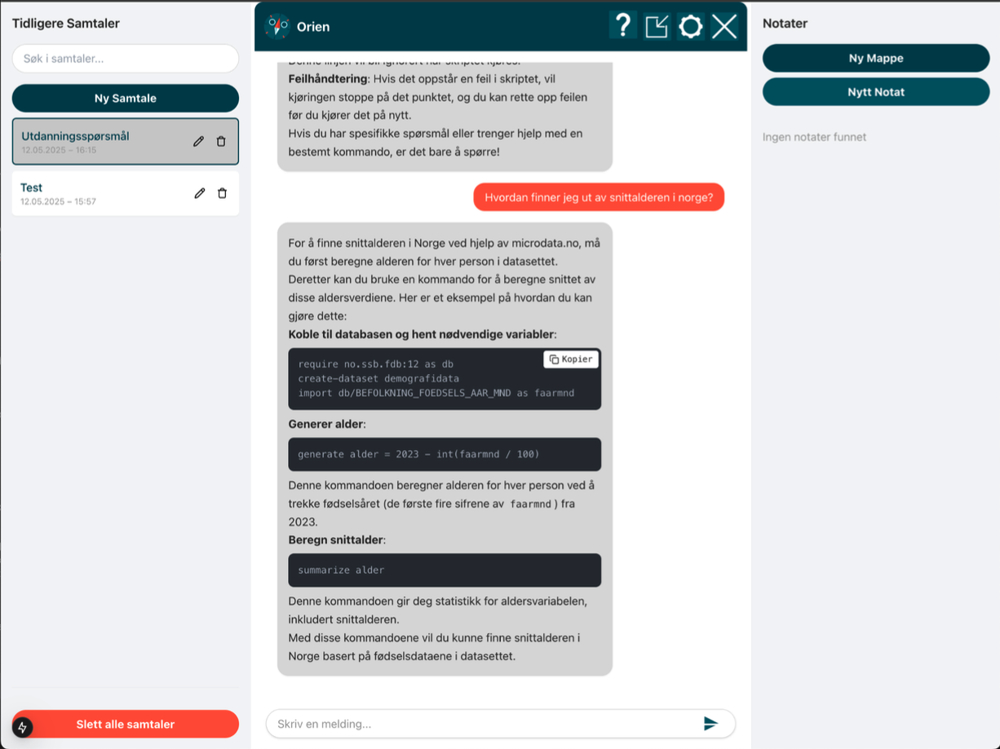

# Chatbot for Microdata.no

Et bachelorprosjekt utviklet våren 2025 ved Høyskolen Kristiania, som
demonstrerer bruk av moderne webteknologi og kunstig intelligens for å forbedre
tilgjengeligheten til dokumentasjonen på Microdata.no.

## Prosjektbeskrivelse

Målet med prosjektet var å utvikle en webapplikasjon som hjelper forskere og
studenter med å forstå og navigere dokumentasjonen og variabel-APIet til
Microdata.no ved hjelp av en AI-drevet chatbot.

Brukeren kan stille naturlige spørsmål (f.eks. "hvilke variabler finnes for
inntekt i 2020?") og få presise og relevante svar basert på offisielle
dokumenter og metadata hentet fra Microdata.

## Funksjonalitet

- AI-chatbot med naturlig språkforståelse
- Sømløs kobling til dokumentasjon og API-variabler
- RAG-arkitektur (Retrieval-Augmented Generation)
- Semantisk søk i dokumentasjon
- Universell utforming (WCAG)
- Enkel og responsiv brukeropplevelse

## Teknologier

- **Next.js** (TypeScript)
- **Tailwind CSS**
- **OpenAI GPT-4 API**
- **LangChain**
- **Pinecone**
- **Zustand**

## Arkitektur

Chatboten benytter RAG-arkitektur:

1. Brukerens spørsmål blir vektorisert og søkt opp i dokumentasjonskilder via
   Pinecone.
2. Relevante dokumentbiter blir kombinert med spørsmålet og sendt til GPT-4 via
   LangChain.
3. Resultatet blir formatert og sendt tilbake til frontend som et streamet svar.

## Grensesnitt

Applikasjonen har et moderne, minimalistisk brukergrensesnitt med fokus på
tilgjengelighet og brukervennlighet.

## Team og roller

Prosjektet ble utviklet av en gruppe bachelorstudenter i Frontend- og
Mobilutvikling ved Høyskolen Kristiania:

- Eirik Andresen – AI-integrasjon og backend
- Ola O. Hårstad – UI og frontendstruktur
- Aurora Strøm – UX-design og visuelt uttrykk

Vi benyttet Scrum som prosjektmetodikk, med ukentlige standups og MVP-basert
utvikling. Alle deltok i både frontend, backend og designoppgaver i ulike faser
av prosjektet.

---

**NB:** For å teste applikasjonen lokalt må du ha gyldig API-nøkkel til OpenAI
og Pinecone konfigurert.
